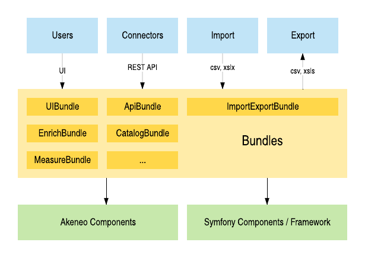

Audience: developers / all proficiency levels 

# Akeneo PIM architecture and extension points for developers

## Main points (plan)
* architecture: components, bundles, best practices.
* points of extensions in Akeneo: tagged services (mostly), custom bundles.
* in general: short learning curve (only for developers with Symfony expirience though).


## Intro

Many companies have experienced problems with managing their product catalogs
in Excel spreadsheets and replaced them with Product Information Management (PIM) 
systems.

PIM allows to centralize and improve product data and 
significantly simplifies product management and maintenance.

One of the leading enterprise PIM solutions is Akeneo PIM - 
a web-based open source software platform.
Akeneo has fancy and friendly UI and plenty of features that enable
companies to import, enrich, translate and distribute product inventories 
to multiple channels.
However, PIM is most effective when fully customized and tailored 
to company specific needs. Fortunately for us, software developers,
Akeneo is based on Symfony framework and inherits its powerful modularity 
and high flexibility.
?It allows to implement ...


## Architecture

While creators of platforms like Drupal, Spryker, Magento 2 preferred to use 
only some of Symfony components, Akeneo software architects decided to 
rely on the Symfony full-stack framework.
For developers who are going to customize Akeneo it 	
primarily means a well-organized application structure and a 
possibility to use bundle system.

Developers can easily create their own controllers an console commands using 
existing Akeneo services to manipulate product data, implement custom connectors 
with external system and extend user interface with new features.

Akeneo PIM relies on well-known for PHP developers Doctrine ORM.
PIM models like products, product models, product groups, 
associations and categories are Doctrine entities.
Akeneo allows to override mappings for an entity field to extend 
standard models with your own fields.

Performance of UI and REST API is ensured by using of the popular 
search engine Elasticsearch. Akeneo uses elasticsearch-php library to query and update
data stored in Elasticsearch indexes.
Developers can not only manipulate data but also implement their own search filters and sorters.

Just like Symfony, Akeneo PIM introduces own components - reusable decoupled libraries,
that implement some specific business or technical logic. 
Every component has corresponding bundle that contain the glue code to embed 
the component into an application. Components and bundles belong to big sets of features  (like Domain-driven Design bounded contexts) 
such as User Management, Channel, Tool, Platform, Pim/Enrichment, Pim/Structure etc.




## Extension points


### Tagged services / Service tags

/***

...which means more than 70 different types of plugins...

used Registry pattern in order to allow external integrators to
implement their own logic to be injected in Akeneo application.

From knp: Tags are the way to hook your services into different parts of the core system.


/***


Akeneo core developers took care of platform's extensibility and
implemented more than 70 hooks that make possible to add your 
custom logic to different parts of the core system.
To use such hook you just need to implement your own service and tag it
in your service configuration.

Examples of tagged services:
* Attribute types (pim_catalog.attribute_type)
* Search filters (pim_catalog.elasticsearch.query.product_filter)
* Collectors of system information (pim_analytics.data_collector)
* Batch jobs (akeneo_batch.job)
* UI dashboard widgets (pim_dashboard.widget)
* File transformation plugins, only in Enterprise Edition (akeneo_file_transformer.transformation)


To demonstrate how to extend Akeneo with tagged services 
let's create a very simple dashboard widget that displays a link to a page 
about raising Ziggy - 

Step 1. Create a class `ZiggyWidget` impementing `WidgetInterface` - 
the contract of all Akeneo dashboard widgets:

```php
<?php

// src/Acme/Bundle/AppBundle/Widget/ZiggyWidget.php

namespace Acme\Bundle\AppBundle\Widget;

use Pim\Bundle\DashboardBundle\Widget\WidgetInterface;

class ZiggyWidget implements WidgetInterface
{
    public function getAlias()
    {
        return 'ziggy';
    }

    public function getTemplate()
    {
        return 'AcmeAppBundle:Widget:ziggy.html.twig';
    }

    public function getParameters()
    {
        return [
            'text' => 'How To Raise A Ziggy',
            'link' => 'https://ziggy.akeneo.com/'
        ];
    }

    // No real data needed for our simple example
    public function getData()
    {
        return [];
    }
}

```

Step 2. Register this class as a service and tag it with the `pim_dashboard.widget` tag
to inform Akeneo about our new widget:

```yaml
services:
    acme_app.widget.ziggy_widget:
        class: Acme\Bundle\AppBundle\Widget\ZiggyWidget
        tags:
            # Set negative value for the position to make your widget above others
            - { name: pim_dashboard.widget, position: -120 }
```

Step 3. Create the template:

```twig





    <ul>
        <li>
            <a href="{{ link }}">{{ text }}</a>
        </li>
    </ul>

```

Step 4. Clear cache and find your widget on the `Activity > Dashboard` page:


### Event System

Another typical approach to extend a functionality of a Symfony 
application is to implement your custom business logic using the event system.

Akeneo implements 

??? from docs: lots of event notifications are triggered. 
Your application can listen to these notifications and respond to them by executing any piece of code.


What is event
Types of events
Examples


## What else

The fact that Akeneo is a Symfony application means unlimited space of...


Custom bundles using PIM services

Besides the extension points there are just normal functionality 
that allows to extend Akeneo functionality
reference data
custom rules
custom api endpoints
Extending entities??


Final word
?


----------------------------------------

## Akeneo extension points

* Decorating services
* Reference data
* custom action rule? (EE) https://docs.akeneo.com/latest/manipulate_pim_data/rule/index.html
* config: programmatically add new measures. metrics? https://docs.akeneo.com/latest/manipulate_pim_data/catalog_structure/how_to_add_a_custom_unit_of_measure.html
* Customize Product Assets (EE) https://docs.akeneo.com/latest/manipulate_pim_data/product_asset/index.html

* adding jobs?

Not recomended: extend entity
BUUUT: here how to extend: https://docs.akeneo.com/latest/manipulate_pim_data/category/add_new_properties_to_a_category.html
?


