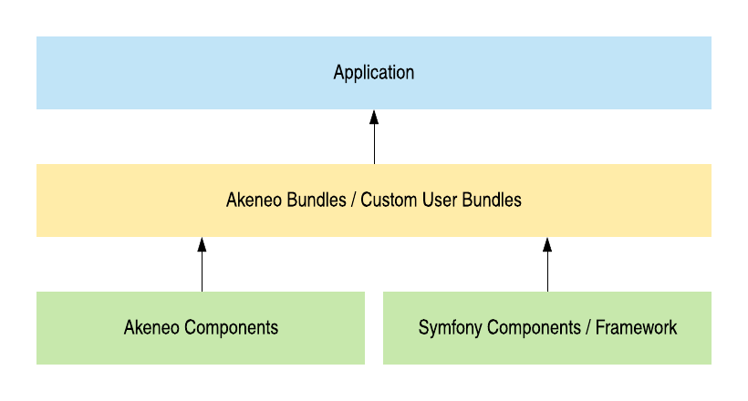
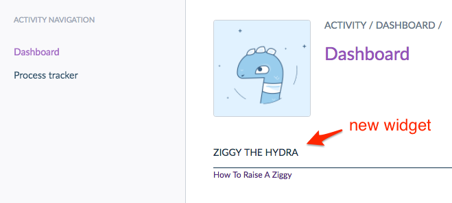

# Akeneo PIM for developers: application stack and extension points

Managing products of your web-shop is often a very challenging task.
Incomplete or unclean product information, inconsistent attribute data, 
lack of attribute structure - if it sounds familiar, then it might be a 
good reason to choose a Product Information Management (PIM) system.

PIM solution is not a panacea for all the problems with data. It is 
only a tool. If you know how to use it, it will help you to centralize 
and improve product data and 
simplify product management and maintenance.

One of the leading enterprise PIM solutions is Akeneo PIM - 
a web-based open source software platform.
Akeneo has fancy and friendly UI and plenty of features that enable
companies to import, process, translate and distribute product inventories 
to multiple channels. However, PIM is most effective when fully customized and tailored 
to company specific needs. Akeneo is based on Symfony framework, inherits its 
modularity and high flexibility and, therefore, allows to implement 
almost any specific requirements.


## Application stack

Platforms like Drupal, Spryker, Magento 2 use Symfony components.
Akeneo is not only using these components, but relies on the Symfony full-stack framework.
For developers who need to customize Akeneo it 	
means primarily a well-organized application structure and a 
possibility to use a bundle system.

Working with Akeneo, you can easily create own controllers and console commands using 
existing Akeneo services to manipulate product data, implement custom connectors 
to external systems and extend user interface.

Akeneo PIM relies on the well-known for PHP developers Doctrine ORM.
PIM data like products, product models, product groups, 
associations and categories are Doctrine entities.
Akeneo allows to override mappings for an entity field to extend 
standard models with your own fields.

Performance of UI and REST API is ensured by using of the popular 
search engine Elasticsearch. Akeneo uses `elasticsearch-php` library to 
query and update data stored in Elasticsearch indexes.
Developers can not only manipulate data but also implement their own search filters 
and sorters.

Just like Symfony, Akeneo PIM introduces own components - reusable decoupled libraries,
that implement some specific business or technical logic. 
Every component has corresponding bundle that contain the glue code to embed 
the component into an application. Components and bundles belong to big sets of features  
(like Domain-driven Design bounded contexts) 
such as User Management, Channel, Tool, Platform, Pim/Enrichment, Pim/Structure etc.




## Extension points

### Tagged services

Akeneo core developers implemented more than 70 hooks that make possible to add your 
custom logic to different parts of the core system.
To use such a hook you just need to implement your own service and accordingly 
tag it in your service configuration.

Examples of tagged services:

| Service type | Tag |
|--------------|-----|
| Attribute type | pim_catalog.attribute_type |
| Search filter | pim_catalog.elasticsearch.query.product_filter |
| Collector of system information | pim_analytics.data_collector |
| Batch job | akeneo_batch.job |
| UI dashboard widget | pim_dashboard.widget |
| File transformation plugin (only in Enterprise Edition) | akeneo_file_transformer.transformation |


To demonstrate how to extend Akeneo with tagged services 
let's create a very simple dashboard widget that displays a link to a page 
about raising Ziggy - the Akeneo's mascot, nice three-headed hydra.

??? Own foto


Step 1. Create a class `ZiggyWidget` implementing `WidgetInterface` - 
the contract of all Akeneo dashboard widgets:

```php
<?php

// src/Acme/Bundle/AppBundle/Widget/ZiggyWidget.php

namespace Acme\Bundle\AppBundle\Widget;

use Pim\Bundle\DashboardBundle\Widget\WidgetInterface;

class ZiggyWidget implements WidgetInterface
{
    public function getAlias()
    {
        return 'ziggy';
    }

    public function getTemplate()
    {
        return 'AcmeAppBundle:Widget:ziggy.html.twig';
    }

    public function getParameters()
    {
        return [
            'text' => 'How To Raise A Ziggy',
            'link' => 'https://ziggy.akeneo.com/'
        ];
    }

    // No real data needed for our simple example
    public function getData()
    {
        return [];
    }
}

```

Step 2. Register this class as a service with the `pim_dashboard.widget` tag
to inform Akeneo about our new widget:

```yaml
# src/Acme/Bundle/AppBundle/Resources/config/services.yml
services:
    acme.widget.ziggy_widget:
        class: Acme\Bundle\AppBundle\Widget\ZiggyWidget
        tags:
            # Set negative value for the position to make your widget above others
            - { name: pim_dashboard.widget, position: -200 }
```

Step 3. Create the template:

```twig





    <ul>
        <li>
            <a href="{{ link }}">{{ text }}</a>
        </li>
    </ul>

```

Step 4. Clear cache and find your widget on the `Activity > Dashboard` page:



### Event System

Another typical approach to extend a functionality of your Symfony 
application are events. Akeneo triggers lots of event notifications.
You can listen to them and respond by executing your own code.
 
This table shows some of the most important types of events:

| Event type | When dispatched |
|------------|-------------|
| Storage events | <ul><li>product is saved to the database</li></ul> |
| Workflow events (only in Enterprise Edition) | <ul><li>product draft is sent for approval</li><li>product draft change is approved</li><li>product draft is approved, rejected or deleted</li></ul> |
| Grid events | data grid is rendered |

To demonstrate the usage of the event system, let's implement a service 
that assigns all red products from a gift category
to a special product group called 'Xmas Gift ideas'.

Step 1. Create the event subscriber class `AddProductsToXmasGiftIdeasGroupSubscriber`
that listens for `StorageEvents::PRE_SAVE` events.

```php
<?php

// src/Acme/Bundle/AppBundle/EventSubscriber/AddProductsToXmasGiftIdeasGroupSubscriber.php

namespace Acme\Bundle\AppBundle\EventSubscriber;

use Akeneo\Pim\Enrichment\Component\Product\Model\ProductInterface;
use Akeneo\Tool\Component\StorageUtils\Repository\IdentifiableObjectRepositoryInterface;
use Akeneo\Tool\Component\StorageUtils\StorageEvents;
use Symfony\Component\EventDispatcher\EventSubscriberInterface;
use Symfony\Component\EventDispatcher\GenericEvent;

class AddProductsToXmasGiftIdeasGroupSubscriber implements EventSubscriberInterface
{
    /**
     * @var IdentifiableObjectRepositoryInterface
     */
    private $groupRepository;

    public function __construct(IdentifiableObjectRepositoryInterface $groupRepository)
    {
        $this->groupRepository = $groupRepository;
    }

    /**
     * {@inheritdoc}
     */
    public static function getSubscribedEvents(): array
    {
        return [
            StorageEvents::PRE_SAVE => 'addProductsToXmasGiftIdeasGroup'
        ];
    }

    public function addProductsToXmasGiftIdeasGroup(GenericEvent $event): void
    {
        // Get the product from the event subject
        $product = $event->getSubject();

        if (!$product instanceof ProductInterface) {
            return;
        }

        // Get the value of the product color
        $colorValue = $product->getValue('color');
        $color = $colorValue->getData()->getCode();
        
        // Get the category code
        $categories = $product->getCategoryCodes();

        // If the product has red color and assigned to the Gifts category
        // add it to the group Xmas Gift Ideas
        if ('red' === $color && in_array('gifts', $categories)) {
            $group = $this->groupRepository->findOneByIdentifier('xmas_gift_ideas');
            $product->addGroup($group);
        }
    }
}
```

Step 2. Register the subscriber.

```yaml
# src/Acme/Bundle/AppBundle/Resources/config/services.yml
services:
    acme.event_subscriber.add_products_to_xmas_gift_ideas_group:
        class: Acme\Bundle\AppBundle\EventSubscriber\AddProductsToXmasGiftIdeasGroupSubscriber
        arguments:
            - '@pim_catalog.repository.group'
        tags:
            - { name: kernel.event_subscriber }

```

Important note: the code above is create only for demonstration of catching Akeneo events.  
In the real application please consider using [Akeneo rules engine](https://help.akeneo.com/articles/what-is-a-rule.html).


## Final word

Tagged services and events are not the only ways of extending an Akeneo application.
You can find many other ways to implement your features inside Akeneo PIM:
e.g., you can add new types of reference data, implement custom API endpoints,
programmatically add new measures and many other things.

The fact that Akeneo is a Symfony application means unlimited space of...
