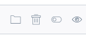

# How to add a new action button in the product grid

Idea: add new button to the product grid. Show a simple alert with product id by clicking on this button for the sake of a demo.

### Backend part
 
1. Implement an event listener that modifies a datagrid configuration

```php
<?php

// src/Acme/Bundle/AppBundle/EventListener/PreviewActionProductGridListener.php

namespace Acme\Bundle\AppBundle\EventListener;

use Oro\Bundle\DataGridBundle\Event\BuildBefore;

class PreviewActionProductGridListener
{
    /**
     * @throws \LogicException
     */
    public function buildBefore(BuildBefore $event)
    {
        $datagridConfig = $event->getConfig();

        $newAction = [
            'label' => 'Preview',
            'launcherOptions' => [
                'className' =>'AknIconButton AknIconButton--small AknIconButton--view',
            ],
            'type' => 'preview-product',
            'link' => 'ajax',
        ];
        
        // Extend the datagrid config with the config for our action 
        $datagridConfig->offsetSetByPath('[actions][preview]', $newAction);
    }
}
```

2. Implement a new action class with no logic

```php
<?php

// src/Acme/Bundle/AppBundle/Datagrid/PreviewProductAction.php

namespace Acme\Bundle\AppBundle\Datagrid;

use Oro\Bundle\DataGridBundle\Extension\Action\Actions\AbstractAction;

class PreviewProductAction extends AbstractAction
{

}
```

See other actions: `vendor/akeneo/pim-community-dev/src/Oro/Bundle/DataGridBundle/Extension/Action/Actions`


3. Register the listener and the action
```yaml

# src/Acme/Bundle/AppBundle/Resources/config/services.yml

services:
    acme.event_listener.product_grid_before_listener:
        class: Acme\Bundle\AppBundle\EventListener\PreviewActionProductGridListener
        tags:
            - { name: kernel.event_listener, event: oro_datagrid.datgrid.build.before.product-grid, method: buildBefore }

    acme.extension.action.type.preview_product:
        class: Acme\Bundle\AppBundle\Datagrid\PreviewProductAction
        shared: false
        tags:
            - { name: oro_datagrid.extension.action.type, type: preview-product }
```

### Frontend part

1. Implement action login in JavaScript

```javascript
// src/Acme/Bundle/AppBundle/Resources/public/js/datagrid/action/preview-product-action.js

define([
        'oro/datagrid/model-action'
    ],
    function(ModelAction) {

        return ModelAction.extend({

            execute: function () {
                alert(this.model.id);
            }
        })
    }
);
```

See more actions: `vendor/akeneo/pim-community-dev/src/Pim/Bundle/DataGridBundle/Resources/public/js/datagrid/action/`

2. Register the action

```yaml
# src/Acme/Bundle/AppBundle/Resources/config/requirejs.yml

config:
    paths:
        oro/datagrid/preview-product-action:       acmeapp/js/datagrid/action/preview-product-action

```

3. Run webpack

`yarn run webpack`


### See it in action

1. Go to your product grid.
2. Now you can see a new action icon in the grid row (4th icon):



3. Click on it and see an alert.
