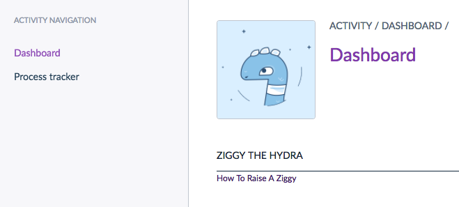

# How to add a new dashboard widget


Create a service class:

```php
<?php

// src/Acme/Bundle/AppBundle/Widget/ZiggyWidget.php

namespace Acme\Bundle\AppBundle\Widget;

use Pim\Bundle\DashboardBundle\Widget\WidgetInterface;

class ZiggyWidget implements WidgetInterface
{
    public function getAlias()
    {
        return 'ziggy';
    }

    public function getTemplate()
    {
        return 'AcmeAppBundle:Widget:ziggy.html.twig';
    }

    public function getParameters()
    {
        return [
            'text' => 'How To Raise A Ziggy',
            'link' => 'https://ziggy.akeneo.com/'
        ];
    }

    public function getData()
    {
        return [];
    }
}

```

Register widget as a tagged service:

```yaml
services:
    acme_app.widget.ziggy_widget:
        class: Acme\Bundle\AppBundle\Widget\ZiggyWidget
        tags:
            # Set negative value for the position to make your widget above others
            - { name: pim_dashboard.widget, position: -120 }
```

Create the template:

```twig





    <ul>
        <li>
            <a href="{{ link }}">{{ text }}</a>
        </li>
    </ul>

```

Clear cache and find your widget on the dashboard:

