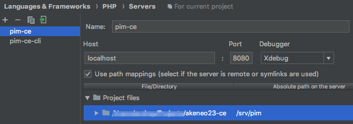

# How to configure Xdebug for the Akeneo 3.x on Mac

## Problem

[This article](https://github.com/akeneo/Dockerfiles/blob/master/Docs/debugging.md) is very good for the beginning 
but it helps only to setup Xdebug for cli for mac users. 


## Solution

### Step 1. Extend your docker-compose configurations:

```yaml
docker-compose.override.yml

fpm:
  image: 'akeneo/fpm:php-7.1'
  user: 'docker'
  volumes:
    - './:/srv/pim:delegated'
  working_dir: '/srv/pim'
  networks:
    - 'akeneo'
    - 'behat'
  environment:
    PHP_IDE_CONFIG: 'serverName=pim-ce-cli'
    PHP_XDEBUG_ENABLED: 1
    PHP_XDEBUG_IDE_KEY: 'PHPSTORM'
    PHP_XDEBUG_REMOTE_HOST: 'host.docker.internal'
    XDEBUG_CONFIG: 'remote_host=host.docker.internal'

httpd:
  environment:
    PHP_IDE_CONFIG: 'serverName=pim-ce'
```

### Step 2. Extend webserver configuration
```
# docker/httpd.conf
ProxyFCGISetEnvIf "true" REMOTE_ADDR "host.docker.internal"
```

Restart httpd if needed: 
`docker-compose exec httpd bash -c "apachectl -k graceful"`


### Check it

Check that Xdebug configuration is ok in your fmp container
`docker-compose exec fpm bash -c "cat /etc/php/7.1/fpm/conf.d/20-xdebug.ini"`

```
zend_extension=xdebug.so
xdebug.remote_enable=1
xdebug.max_nesting_level=1500
xdebug.idekey=PHPSTORM
xdebug.remote_connect_back=0
```

### Configure PHPStorm



### Useful links

* [Debugging PHP with Xdebug: a 2018 handbook](https://enrise.com/2018/02/debugging-php-with-xdebug/)
* [Xdebug settings](https://xdebug.org/docs/all_settings)
* [Apache ProxyFCGISetEnvIf Directive](https://httpd.apache.org/docs/2.4/mod/mod_proxy_fcgi.html#proxyfcgisetenvif)
* [Similar issue: xdebug on Mac needs nginx REMOTE_ADDR set](https://github.com/laradock/laradock/issues/733)

### Possible ways to improve a solution

* Idea: avoid setting `REMOTE_ADDR` and use `X-Forwarder-For` instead.

